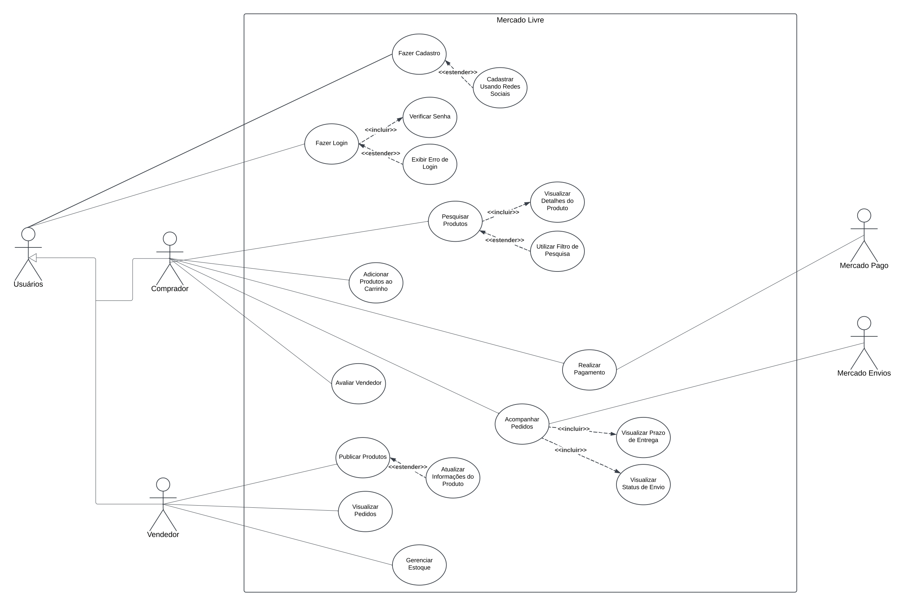

# Documentação do Processo de Modelagem - Mercado Livre

## Introdução

O processo de modelagem é essencial para compreender e representar o funcionamento de um sistema de maneira estruturada, identificando suas principais funcionalidades, atores envolvidos e interações. Neste trabalho, o foco está no aplicativo Mercado Livre, uma plataforma amplamente utilizada para compra e venda de produtos. A modelagem busca descrever os principais casos de uso e cenários, fornecendo uma visão detalhada do comportamento do sistema e suas interações com o ambiente.

Os cenários descritos servem como uma ferramenta complementar, detalhando as ações dos atores e os comportamentos esperados para as funcionalidades principais do sistema. Assim, este documento reúne as decisões, metodologias e resultados do processo de modelagem.

---

## Objetivo

O objetivo principal da modelagem é representar de forma clara e detalhada as funcionalidades e os fluxos do sistema Mercado Livre. Isso inclui:

- Identificar os principais casos de uso.
- Descrever os cenários associados às interações mais relevantes.
- Documentar restrições e exceções que impactam o comportamento esperado do sistema.

---

## Metodologia

### Definição dos Casos de Uso
- Identificação das funcionalidades principais do sistema.
- Associações entre atores e casos de uso.
- Uso de relacionamentos (inclusão, extensão e generalização) para detalhar as interações.

### Elaboração de Cenários
- Identificação de tarefas críticas no fluxo do sistema.
- Descrição dos cenários seguindo uma estrutura padrão:
  - **Título**, **objetivo**, **contexto**, **recursos**, **atores**, **episódios**, **restrições** e **exceções**.
- Distribuição de responsabilidades entre os membros da equipe para a criação de cenários específicos.

### Documentação do Processo
- Registro das decisões tomadas durante a modelagem.
- Representação gráfica e textual dos casos de uso.
- Compilação dos cenários detalhados.

---

## Casos de Uso

Os casos de uso foram definidos a partir das principais funcionalidades do Mercado Livre, abrangendo tanto o ponto de vista do comprador quanto do vendedor. Abaixo estão alguns dos casos de uso mapeados:

### Pesquisar Produtos
- **Ator Primário:** Comprador  
- **Relacionamentos:**
  - Inclusão: Visualizar Detalhes do Produto.

### Adicionar ao Carrinho
- **Ator Primário:** Comprador

### Realizar Pagamento
- **Ator Primário:** Comprador  
- **Ator Secundário:** Mercado Pago  
- **Ações:** Finalização do pagamento e integração com o sistema de pagamentos.

### Cadastro de Produto pelo Vendedor
- **Ator Primário:** Vendedor  
- **Ações:** Preenchimento de dados do produto, configurações de envio e publicação.

---

## Cenários

Os cenários foram desenvolvidos para detalhar as interações entre atores e o sistema em situações específicas. Cada cenário apresenta:

- **Título e Objetivo:** Descreve a tarefa e seu propósito.
- **Contexto:** Define o estado inicial e a motivação para a ação.
- **Recursos:** Lista os meios necessários para a realização do cenário.
- **Atores:** Identifica quem realiza a tarefa.
- **Episódios:** Enumera os passos do cenário.
- **Restrições e Exceções:** Aponta limitações e condições que podem impactar a execução.

### Exemplos de Cenários
- Cadastro de Produto pelo Vendedor.
- Compra de Produto pelo Comprador.
- Avaliação de Produto pelo Comprador.
- Atendimento ao Cliente via Chat.
- Devolução de Produto pelo Comprador.
- Promoção de Produtos pelo Vendedor.

---

## Conclusão

A modelagem do Mercado Livre proporciona uma visão ampla e detalhada do sistema, organizando suas funcionalidades em casos de uso e cenários. Essa abordagem permite:

- Melhor compreensão das interações entre os atores e o sistema.
- Identificação de fluxos de trabalho e dependências.
- Representação das restrições e exceções que impactam a experiência do usuário.

Este documento serve como referência para o desenvolvimento e análise do sistema, além de facilitar a comunicação entre os membros da equipe. Com isso, espera-se que o projeto alcance os objetivos propostos com clareza e eficiência.

# **Caso de uso**

  

